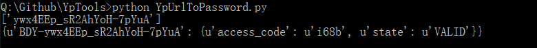

# YpTools

云盘工具

### url to password




#### 用正则提取出对应的Url下的参数 

```python

def matchall(text, patterns):
    """Scans through a string for substrings matched some patterns.

    Args:
        text: A string to be scanned.
        patterns: a list of regex pattern.

    Returns:
        a list if matched. empty if not.
    """

    ret = []
    for pattern in patterns:
        try:
            match = re.findall(pattern, text)
        except(TypeError):
            match = re.findall(pattern, str(text))
        ret += match

        if ret:
            return ret

    return None


```

### Tips 

（1）使用云盘万能钥匙api

